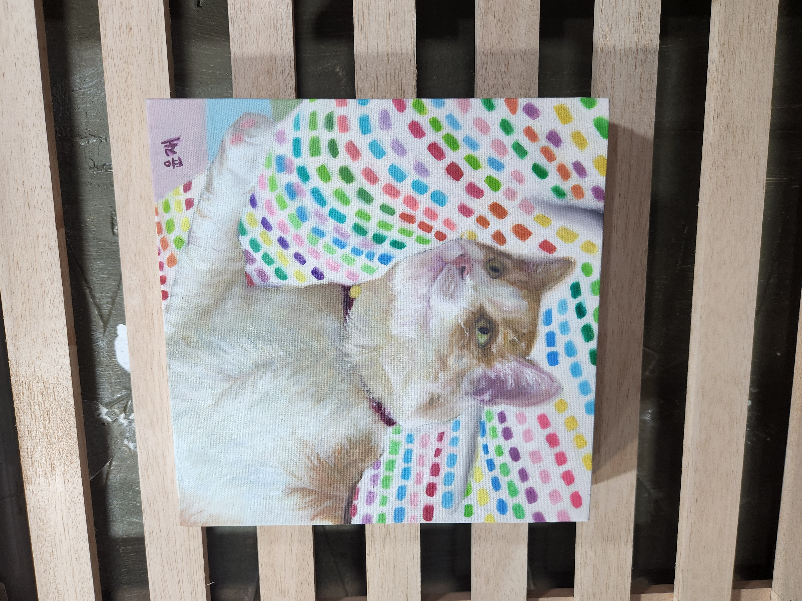
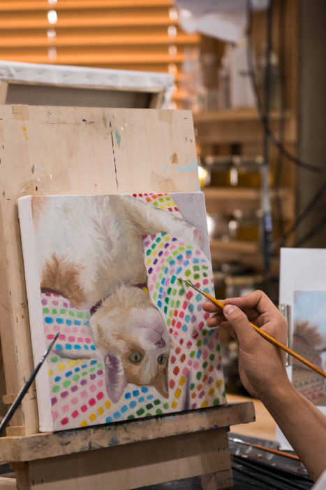
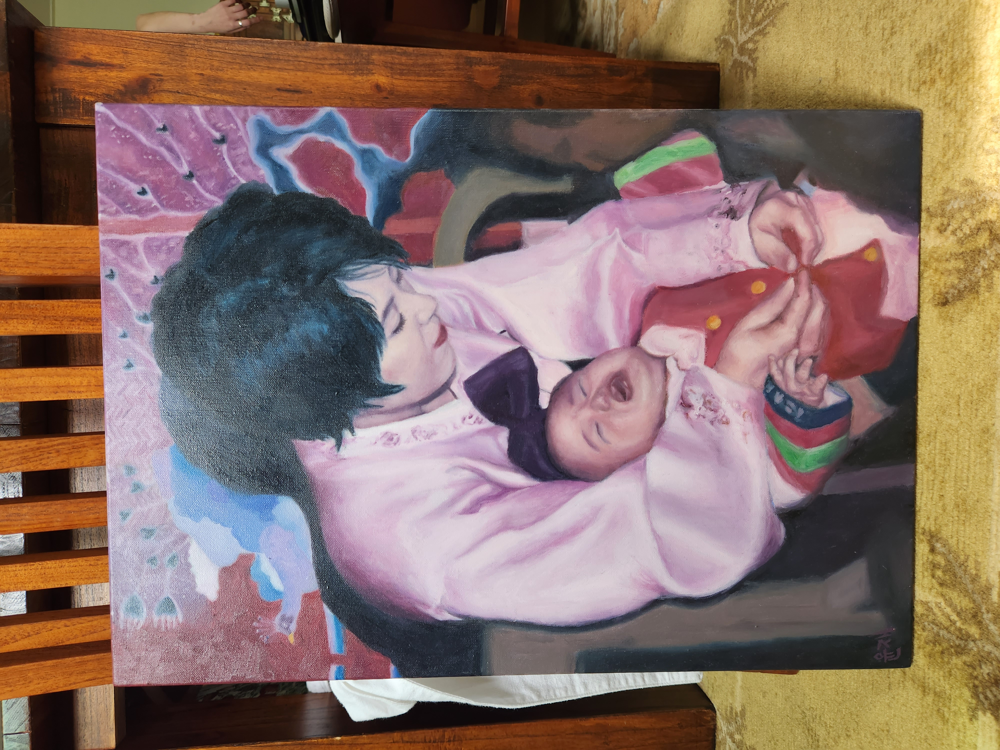
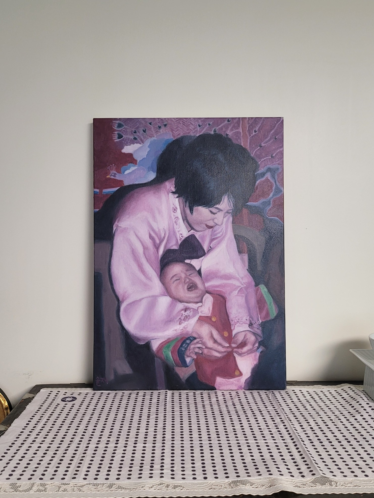
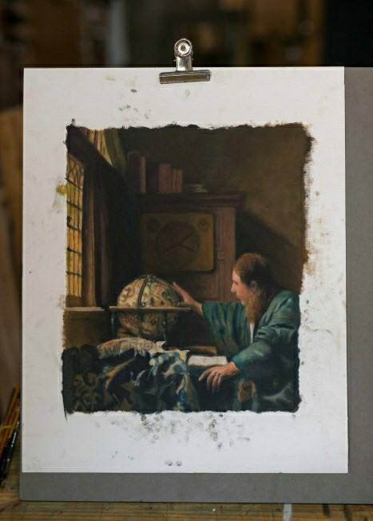
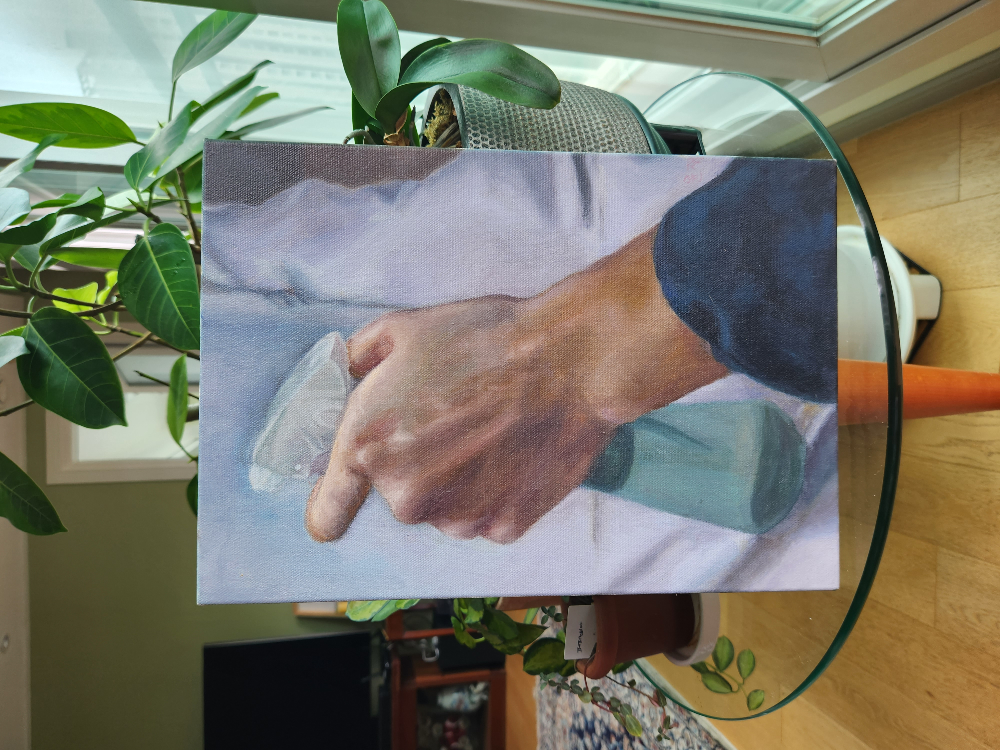
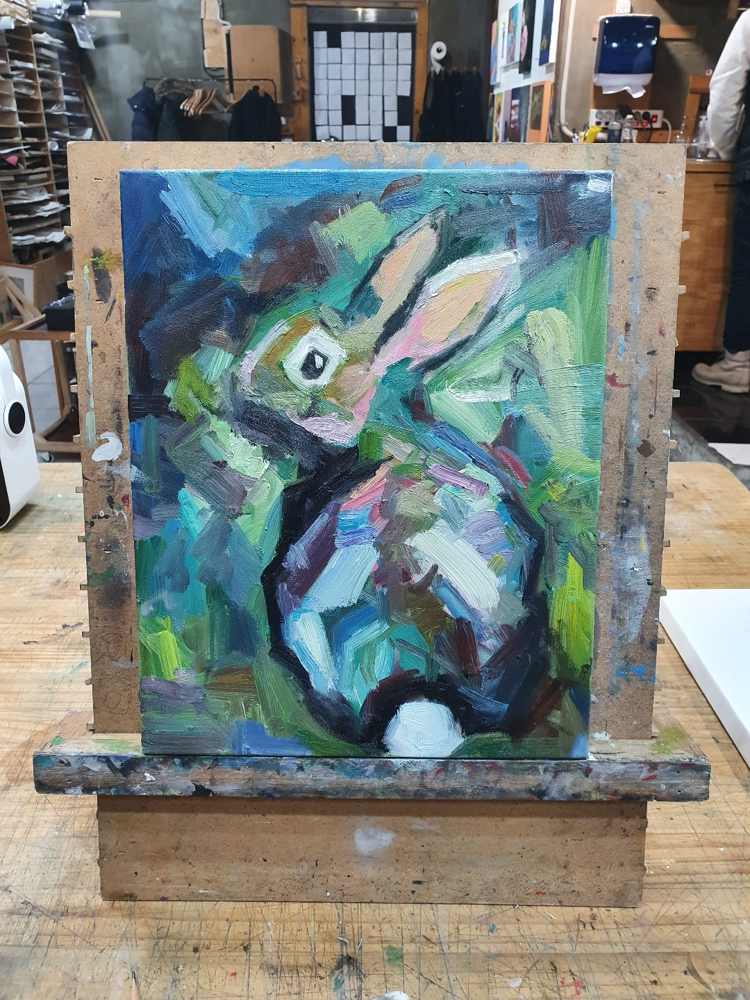
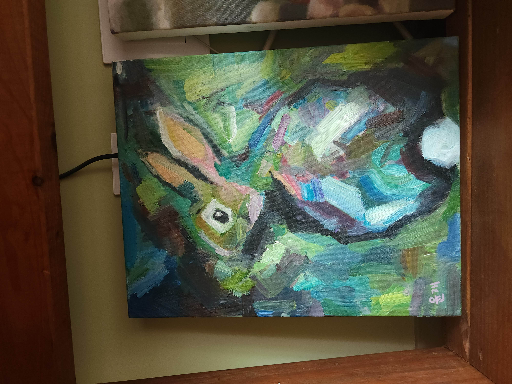
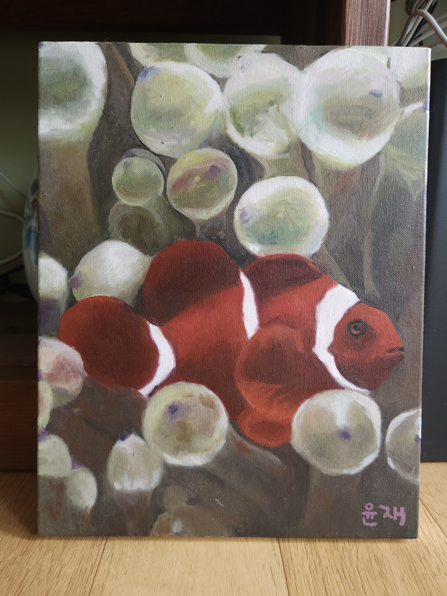

# Paintings by me
<!-- 
## Lady with an Umbrella  
*In Progress*  
-->
## Morris
  

  
Painting of my nephew, Morris.  

## First Birthday
  
  
<!---->
Painting of my mother and myself, drawn from a photograph of my first birthday.  

## Astronomer (Imitation)
  
Originally by Vermeer.  

## Hand holding sprayer
  
  
Painting of my own hand holding a water sprayer. 

## Rooster
    
Majestic wildlife in its natural habitat. 

## Hare
    
    

## Clownfish

Majestic wildlife in its natural habitat.  

## Urn
    

The first painting I've done using oil paint.  

