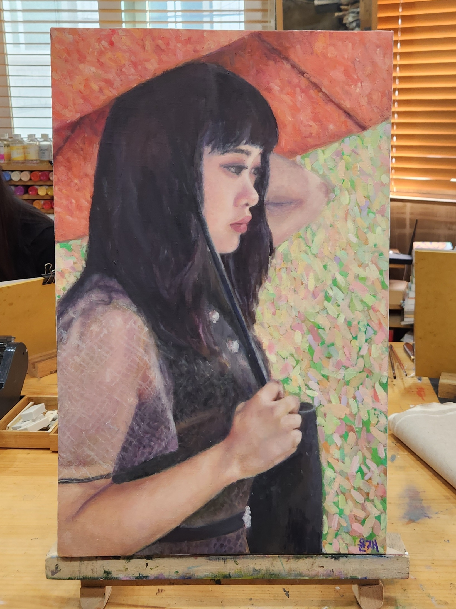

# Paintings by me

All paintings are Oil on Canvas.

## Lady and an Umbrella  
   
   

## Morrie
  

  
Painting of my nephew, Morrie.  

## First Birthday
<!---->
  
Painting of my mother and myself, drawn from a photograph on my first birthday.  

## Astronomer (Imitation)
  
Originally by Vermeer.  

## Hand holding sprayer
  
  
Painting of my own hand holding a water sprayer. 

## Rooster
    

## Hare
    
<!--  -->  

## Clownfish

## Urn
    

The first painting I've done using oil paint.  

